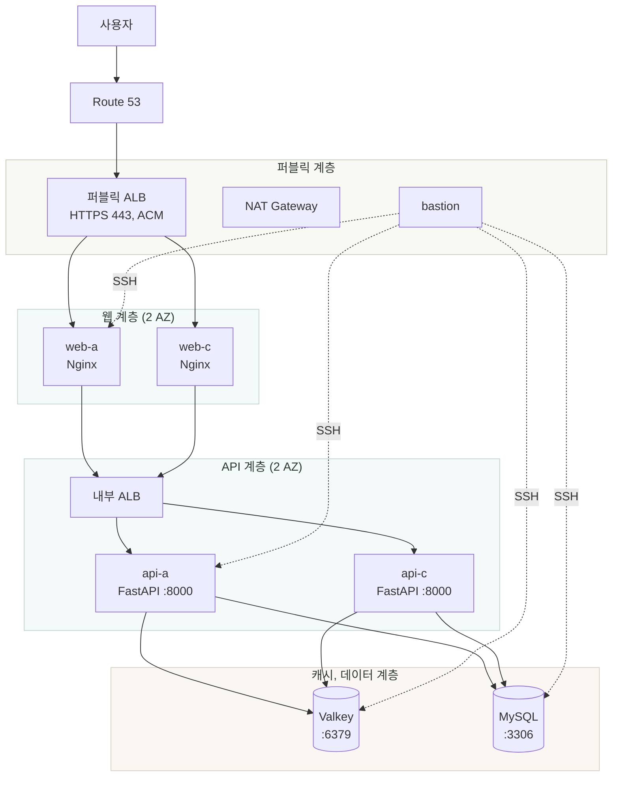
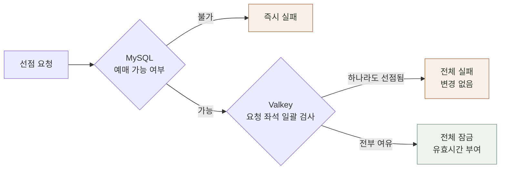

<div align="center">

# 새싹티켓 (sesac-ticket)

**공연 예매 티켓팅 서비스**

대기열 진입부터 좌석 선점, 예매, 관리자 확정까지의 흐름을 구현하고<br>
AWS 인프라를 계층별로 직접 구성해 배포한 프로젝트

<br>

[](https://gamza-dev.shop)

<br>


</div>

<br>

> [!NOTE]
> 예매 오픈 시점처럼 요청이 몰리는 상황에서 같은 좌석이 중복 예매되지 않도록 하는 것,
> 그리고 그 트래픽을 받아낼 인프라를 계층별로 나누어 구성하는 것을 목표로 함.

<br>

## 목차

| | |
| --- | --- |
| [1. 서비스 흐름](#1-서비스-흐름) | 사용자가 예매를 완료하기까지의 단계 |
| [2. 주요 기능](#2-주요-기능) | 영역별 구현 범위 |
| [3. 기술 스택](#3-기술-스택) | 사용 기술과 선택 기준 |
| [4. 아키텍처](#4-아키텍처) | 인프라 구성도, 요청 경로, 설계 판단 |
| [5. 핵심 구현](#5-핵심-구현) | 좌석 선점, 대기열, 작업 중복 방지 |
| [6. 배포](#6-배포) | 구성 순서, 배포 확인, 남은 과제 |
| [7. 트러블슈팅](#7-트러블슈팅) | 배포 환경에서 발생한 문제 2건 |
| [8. 로컬 실행](#8-로컬-실행) | 개발 환경 세팅 |
| [9. 프로젝트 구조](#9-프로젝트-구조) | 디렉터리 구성 |
| [10. 팀](#10-팀) | 역할 분담 |

<br>

## 1. 서비스 흐름


각 단계에서 다음 상태를 관리함.

- **대기열** Valkey에 진입 순서 저장, 3초마다 앞에서 50명씩 입장권 발급
- **좌석 선점** Valkey 잠금으로 중복 선점 차단, 유효시간 만료 시 자동 해제
- **예매** MySQL에 저장, 중복 방지 제약 조건으로 같은 좌석 이중 예매 차단
- **확정** 관리자가 입금 확인 시 입금대기에서 예매확정으로 상태 전환

<br>

## 2. 주요 기능

<table>
<tr>
<th width="140">영역</th>
<th>기능</th>
</tr>
<tr>
<td><b>회원, 인증</b></td>
<td>가입, 로그인(JWT + refresh 쿠키), 비밀번호 재설정, 이메일 인증, 관심 공연 등록</td>
</tr>
<tr>
<td><b>공연</b></td>
<td>목록, 검색, 상세 조회, 회차 조회, 좌석 배치도</td>
</tr>
<tr>
<td><b>대기열</b></td>
<td>진입 시 순번과 예상 대기시간 발급, 3초 간격 폴링, 순서 도달 시 입장권 발급</td>
</tr>
<tr>
<td><b>예매</b></td>
<td>좌석 선점, 무통장입금 예매 생성, 예매 내역 조회</td>
</tr>
<tr>
<td><b>관리자</b></td>
<td>회원과 분리된 로그인 체계, 입금 확인 후 예매 확정</td>
</tr>
<tr>
<td><b>시스템</b></td>
<td>헬스체크, 프론트와 API 버전 및 요청 처리 서버 정보 노출</td>
</tr>
</table>

<br>

## 3. 기술 스택

| 구분 | 사용 기술 |
| :--- | :--- |
| **Backend** | Python 3.12, FastAPI, SQLAlchemy, Gunicorn + Uvicorn Worker |
| **Frontend** | React 19, TypeScript, Vite, MUI, React Query, React Hook Form |
| **Database** | MySQL 8.0 |
| **Cache** | Valkey 7 |
| **Infra** | AWS VPC, ALB, EC2, Route 53, ACM, NAT Gateway, Nginx |

> [!IMPORTANT]
> 데이터 저장소는 관리형 서비스(RDS, ElastiCache) 대신 **EC2에 직접 설치**해 운영함.
> 설정 파일, 접근 제어, 버전 호환을 직접 다뤄보는 것이 목적이었음.

<br>

## 4. 아키텍처

VPC 하나에 가용영역 두 개를 두고, 서브넷을 역할에 따라 **다섯 계층**으로 분리함.
인터넷에 노출되는 리소스는 ALB와 NAT Gateway, bastion 세 가지뿐이며 애플리케이션 서버와 데이터 저장소는 모두 프라이빗 서브넷에 위치함.



### 요청 경로

| 순서 | 구간 | 포트 | 보안그룹 인바운드 |
| :---: | :--- | :---: | :--- |
| 1 | 인터넷 → 퍼블릭 ALB | `443` | 전체 허용, ACM 인증서로 HTTPS 처리 |
| 2 | 퍼블릭 ALB → 웹 서버 | `80` | 퍼블릭 ALB 보안그룹 |
| 3 | 웹 서버 → 내부 ALB | `80` | 웹 보안그룹 |
| 4 | 내부 ALB → API 서버 | `8000` | 내부 ALB 보안그룹 |
| 5 | API 서버 → Valkey | `6379` | API 보안그룹 |
| 6 | API 서버 → MySQL | `3306` | API 보안그룹 |

- 각 계층은 **바로 앞단에서 오는 요청만** 수신함. 인터넷에서 API나 데이터베이스로 직접 접근하는 경로는 없음
- 외부로 나가는 통신은 모두 NAT Gateway를 경유함
- 관리 접속은 bastion을 통해서만 가능하며, 프라이빗 서브넷 서버는 bastion 외 SSH 인바운드를 허용하지 않음
- 내부 서버 간 통신은 IP 대신 Route 53 프라이빗 호스팅 존의 도메인을 사용함

### 설계 판단

<table>
<tr>
<th width="200">항목</th>
<th>판단 내용</th>
</tr>
<tr>
<td><b>보안그룹 연결 방식</b></td>
<td>인바운드 규칙의 출발지를 IP 대역이 아니라 앞단의 보안그룹으로 지정함. 서버를 추가해도 규칙 수정이 필요 없음</td>
</tr>
<tr>
<td><b>ALB 2단 구성</b></td>
<td>외부 진입점을 퍼블릭 ALB 하나로 두고 API는 내부 ALB를 통해서만 호출되도록 함. API 서버가 인터넷에 노출되지 않으며 웹과 API를 독립적으로 확장할 수 있음</td>
</tr>
<tr>
<td><b>폴링 방식 채택</b></td>
<td>ALB 2단 구성으로 연결 유휴 타임아웃 지점이 두 곳이 됨. 대기열 상태 전달을 서버 푸시 방식 대신 3초 간격 폴링으로 구현함</td>
</tr>
<tr>
<td><b>단일 인스턴스 운영</b></td>
<td>MySQL과 Valkey는 이중화를 계획했으나 이 규모에서는 복제 지연으로 인한 정합성 문제가 더 크다고 판단해 각각 한 대로 정리함. S3는 사용하지 않았고 NAT Gateway는 비용을 고려해 한 개만 배치함</td>
</tr>
<tr>
<td><b>확장 여지 확보</b></td>
<td>DB 세션을 쓰기용과 읽기용으로 미리 분리해 복제 서버 추가 시 연결 설정만 변경하면 되도록 함. 나머지 가용영역의 서브넷도 비워둔 상태로 생성해 둠</td>
</tr>
<tr>
<td><b>가용영역 배치</b></td>
<td>웹과 API 서버는 두 가용영역에 한 대씩 배치해 ALB가 요청을 분산하도록 함. 데이터베이스와 캐시, NAT Gateway, bastion은 비용을 고려해 단일 가용영역에 배치함</td>
</tr>
</table>

<br>

## 5. 핵심 구현

### 좌석 선점

같은 좌석에 동시 요청이 들어와도 한 명만 선점하도록 두 단계로 처리함.



- **1단계** MySQL에서 해당 좌석이 예매 가능한 상태인지 확인함. 빠른 실패 처리용
- **2단계** Valkey에서 요청한 좌석을 한 번에 검사하고 한 번에 잠금. 좌석을 확인하는 사이에 다른 요청이 끼어들어 좌석이 나뉘어 잡히는 상황을 막기 위해 Valkey 내부에서 중단 없이 실행되는 스크립트로 작성함
- 요청한 좌석 중 하나라도 이미 선점되어 있으면 나머지도 잠그지 않고 **전체 실패**로 처리함
- 선점된 좌석에는 유효시간을 부여하고, 별도 작업이 만료된 선점을 찾아 MySQL의 좌석 상태를 예매 가능으로 되돌림. 사용자가 창을 닫아도 좌석이 계속 묶여 있지 않음

### 대기열

- Valkey에 진입 순서를 저장하고 **3초마다 앞에서 50명씩** 내보내며 입장권을 발급함
- 입장권이 있어야 좌석 선점 API를 호출할 수 있으므로 **예매 요청이 들어오는 시점을 조절**할 수 있음
- 내보내는 인원 수와 간격은 설정값으로 조정 가능함

### 백그라운드 작업 중복 방지

> [!WARNING]
> API 서버가 두 대이므로 대기열 방출과 선점 만료 정리 작업이 각 서버에서 동시에 실행되는 문제가 있었음.
> 입장권 중복 발급, 좌석 상태 중복 처리 위험이 존재함.

- Valkey에 잠금 키를 두고 **먼저 잡은 서버만** 실제 작업을 수행하도록 처리함
- 잠금에 30초 유효시간을 두고 작업 중 갱신하므로, 해당 서버에 문제가 생기면 30초 안에 다른 서버가 이어받음

### 데이터 저장 기준

| 저장소 | 보관 대상 | 특징 |
| :--- | :--- | :--- |
| **MySQL** | 회원, 공연, 회차, 좌석, 예매, 결제 | 회차별 좌석과 예매에 중복 방지 제약 조건 적용 |
| **Valkey** | 좌석 잠금, 선점 세션, 대기열 순번, 입장권, 로그인 세션 | 전부 유효시간 부여, 시간 경과 시 자동 소멸 |

<br>

## 6. 배포

AWS 콘솔에서 리소스를 직접 생성하는 방식으로 구성했으며 다음 순서로 진행함.

| 단계 | 작업 | 세부 내용 |
| :---: | :--- | :--- |
| 1 | **네트워크, 보안** | VPC, 서브넷 5계층, 인터넷 게이트웨이, NAT Gateway, 라우팅 테이블, 보안그룹 6종, ALB 2대와 타깃그룹, ACM 인증서, Route 53 퍼블릭 존과 프라이빗 존 생성 |
| 2 | **서버 구성** | bastion, 웹 서버(Nginx, Node), API 서버(Python), Valkey 서버, MySQL 서버 세팅 및 초기 데이터 적재 |
| 3 | **ALB 연결** | 웹과 API 서버를 각 타깃그룹에 등록해 요청 분산 구성 |
| 4 | **헬스체크** | 프로세스 상태 확인 경로와 데이터베이스, Valkey 연결까지 확인하는 경로를 분리해 타깃그룹에 연결 |

### 배포 확인

서비스 화면 상단에 다음 정보를 노출함.

- 프론트엔드 버전, API 버전
- 요청을 처리한 웹 서버와 API 서버의 IP

새로고침 시 서버 IP가 변경되는 것으로 **ALB의 요청 분산 동작을 화면에서 바로 확인**할 수 있음.

### 남은 과제

- [ ] Terraform을 이용한 인프라 코드화 (현재 콘솔 기반 구성)
- [ ] systemd 및 배포 스크립트를 이용한 서버 실행 자동화 (현재 bastion 경유 수동 실행)
- [ ] 부하 테스트를 통한 오토스케일링 기준 수립
- [ ] 백그라운드 작업을 애플리케이션 프로세스에서 분리
- [ ] 데이터베이스, 캐시 이중화

<br>

## 7. 트러블슈팅

<details>
<summary><b>대기열 방출 기능이 동작하지 않음</b></summary>

<br>

**증상**

대기열에서 사용자를 내보내는 기능이 동작하지 않고 명령어를 인식하지 못한다는 오류가 발생함. 좌석 상태 조회에서도 500 오류가 발생함.

**원인**

Redis 클라이언트 라이브러리 버전과 통신 프로토콜 설정 조합에서, 여러 값을 한 번에 전달하는 명령이 정상 동작하지 않음.

**해결**

해당 명령을 단일 값 단위로 나누어 호출하는 방식으로 변경함.

**확인한 점**

관리형 서비스가 아닌 직접 설치 환경에서는 라이브러리와 서버의 버전 조합까지 직접 확인해야 함.

</details>

<details>
<summary><b>백그라운드 작업이 서버 대수만큼 중복 실행됨</b></summary>

<br>

**증상**

대기열 방출과 선점 만료 정리 작업이 API 서버 두 대에서 각각 실행됨. 입장권 중복 발급과 좌석 상태 중복 처리 위험이 있었음.

**원인**

백그라운드 작업이 애플리케이션 프로세스와 함께 실행되도록 구성되어 있음.

**해결**

Valkey에 잠금 키를 두고 먼저 잡은 서버만 작업을 수행하도록 변경함.

**확인한 점**

서버를 수평 확장하기 전에 해당 코드가 여러 번 실행되어도 되는지 먼저 확인해야 함.

</details>

<br>

## 8. 로컬 실행

### 사전 요구 사항

| 항목 | 버전 |
| :--- | :--- |
| Python | 3.12 (+ [uv](https://docs.astral.sh/uv/)) |
| Node.js | 22 |
| MySQL | 8.0 |
| Valkey | 7 (또는 Redis 7) |

### 백엔드

```bash
git clone https://github.com/juyeoon/sesac-ticket.git
cd sesac-ticket

uv python install 3.12
uv venv --python 3.12

cd api
cp .env.example .env   # DB, Valkey 접속 정보 및 JWT 설정 입력
uv run uvicorn app.main:app --host 0.0.0.0 --port 8000
```

실행 후 `/docs` 경로에서 API 문서를 확인할 수 있음.

### 초기 데이터

```bash
cd api
uv run python -m scripts.perf_seed    # 공연, 회차, 좌석 데이터 생성
uv run python -m scripts.admin_seed   # 관리자 계정 생성
```

### 프론트엔드

```bash
cd web/frontend
npm install
npm run dev
```

<br>

## 9. 프로젝트 구조

```
sesac-ticket
├── api                      # FastAPI 백엔드
│   └── app
│       ├── api              # 라우터 등록
│       ├── cache            # Valkey 클라이언트, 키 정의, 스크립트
│       ├── core             # 설정, 예외, 보안, 로깅
│       ├── db               # 세션, 읽기 쓰기 라우팅
│       ├── deps             # 인증 및 입장권 검증
│       ├── domains          # 도메인별 모듈
│       │   ├── auth         # 인증
│       │   ├── member       # 회원
│       │   ├── admin        # 관리자
│       │   ├── performance  # 공연, 회차
│       │   ├── venue        # 공연장, 좌석
│       │   ├── queue        # 대기열
│       │   ├── reservation  # 예매, 좌석 선점
│       │   ├── payment      # 결제
│       │   ├── support      # 고객센터
│       │   └── system       # 헬스체크, 버전 정보
│       └── workers          # 대기열 방출, 선점 만료 정리
├── web/frontend             # React 프론트엔드
└── docs                     # 설계 문서, API 명세
```

> [!TIP]
> 캐시 키 문자열은 `api/app/cache/keys.py` 한 곳에서 함수로 정의함.
> 여러 명이 같은 캐시를 사용하므로 키 불일치를 방지하기 위함.

<br>

## 10. 팀

| 이름 | 담당 |
| :--- | :--- |
| **안현지** | 프론트엔드 |
| **박주연** | 백엔드 (공연 정보, 통합) |
| **신다란** | 백엔드 (공통, 인증, 대기열, 예매) |

<br>

<div align="center">

새싹 SeSAC 1조 프로젝트<br>개발 기간 2026.08.18 ~ 2026.08.21

</div>
